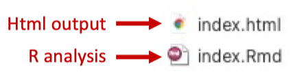
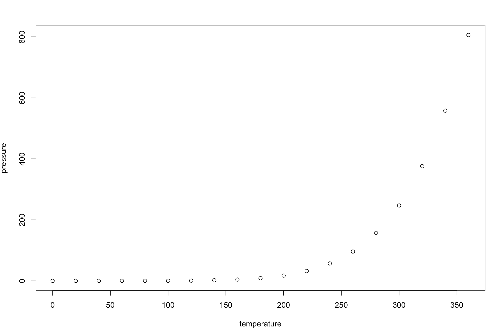

## Create a R Markdown file




## Add your analysis

write markdown content in this 


::: {.cell hash='index_cache/html/unnamed-chunk-1_d00423fae5d4ffc53564ce161da1fc9c'}

```{.r .cell-code}
summary(cars)
```
:::


```
> summary(cars)
     speed           dist       
 Min.   : 4.0   Min.   :  2.00  
 1st Qu.:12.0   1st Qu.: 26.00  
 Median :15.0   Median : 36.00  
 Mean   :15.4   Mean   : 42.98  
 3rd Qu.:19.0   3rd Qu.: 56.00  
 Max.   :25.0   Max.   :120.00 
```

Including Plots

You can also embed plots, for example:


::: {.cell hash='index_cache/html/unnamed-chunk-2_9c36fecfd7825ae654435195c37a6d72'}

```{.r .cell-code}
plot(pressure)
```
:::




## Store your analysis on Github

- open github: [jixing475 (Jixing Liu) ](https://github.com/jixing475)
- click on New
- add a name, and make it public
- copy the address in the 

cd pwd


::: {.cell hash='index_cache/html/unnamed-chunk-3_5c1c855358f2ffa4cfe353348d368713'}

```{.bash .cell-code}
# echo "# make_your_data_analysis_website" >> README.md
git init
git add -A
git commit -m "first commit"
git branch -M main
git remote add origin https://github.com/jixing475/make_your_data_analysis_website.git
git push -u origin main
```
:::


## Make it a website
## Use a template to make the report look better
